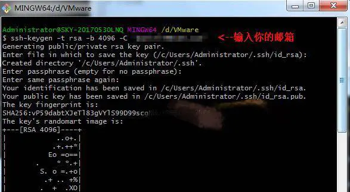
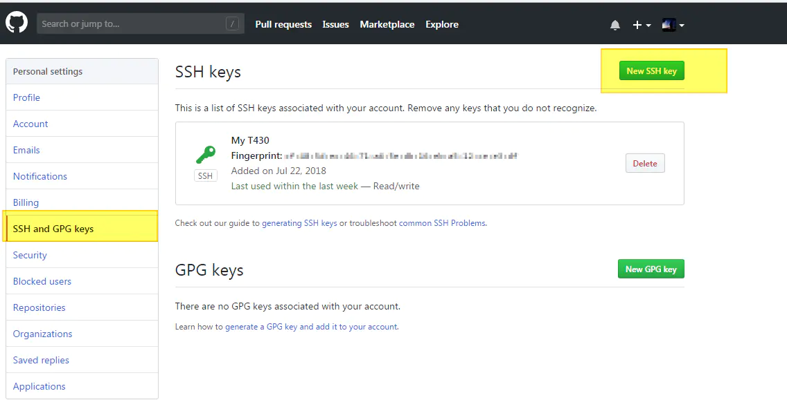
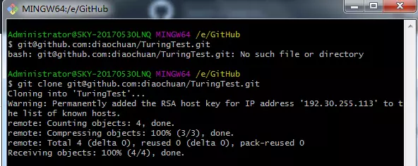

# testgithub
This is a "Hello World" project.


## １. 什么是GitHub?
GitHub是一个面向开源及私有软件项目的托管平台，因为只支持git作为唯一的版本库格式进行托管，故名GitHub。

这里需要辨析一下GitHub与Git的概念。GitHub是代码托管平台；而Git是版本控制工具。Git不需要联网，在本机就可以使用。Git和GitHub双剑合璧，搭配使用是最顺畅的。当然，Git也可以和其他的代码托管平台结合使用，例如，国内的码云（gitee.com）。

## 2. 如何注册GitHub账号？

## ３. 如何创建第一个远程仓库？
可以参考GitHub官方的“hello world”说明。

```
 https://guides.github.com/activities/hello-world/
```

### ３.１ 配置用户名和邮箱：
```
git config --global user.name "你的用户名"
git config --global user.email "你的邮箱"
```

### ３.２生成并配置ssh的公钥
运行 ssh-keygen -t rsa -C "你的邮箱" ，会有三次等待你输入，直接回车即可。这一步生成电脑的ssh的公钥和私钥。



然后，用记事本打开对应的公钥文件，并进入SSH and GPG keys菜单，点击New SSH key，将公钥的文本拷贝，保存在GitHub网站上。经过这一步，后续本机git访问GitHub就不需要输入用户密码了。



### ３.３在GitHub上创建远程仓库

访问地址https://github.com/new

### ３.４将远程仓库clone到本地

使用git clone命令，指定新建仓库的ssh地址，回车即可将远程仓库克隆到本地。
```
git clone git@github.com:wangkeyou/EE300_Lab_2020S.git
```

